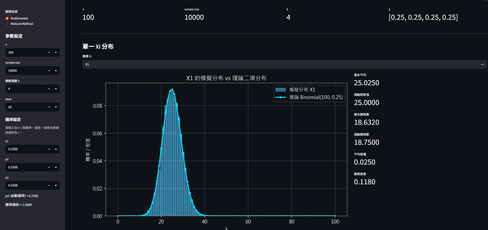
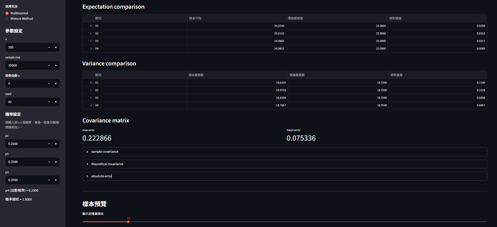
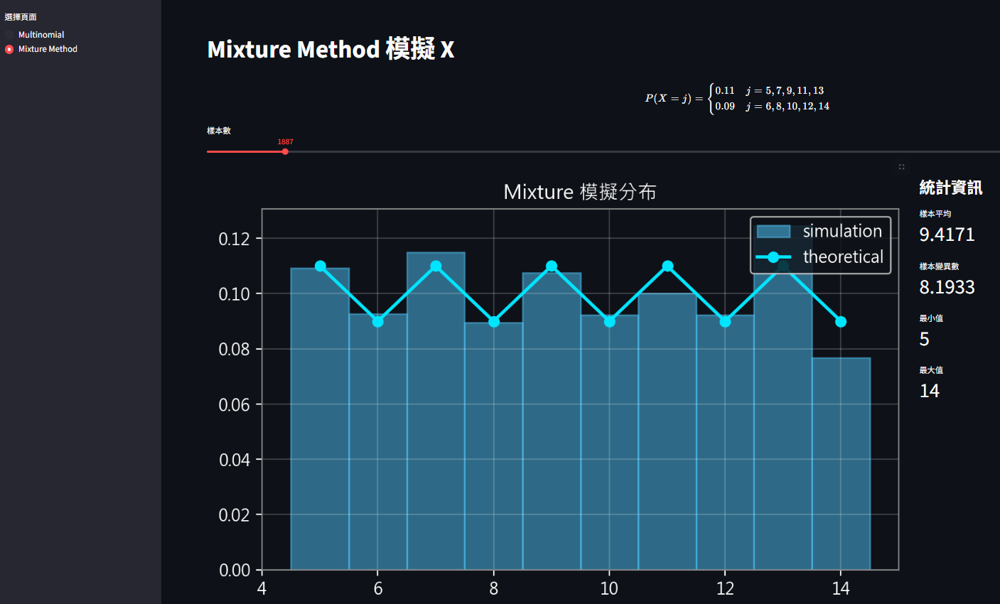

# 🎲 Conditional Multinomial & Mixture Method Simulation App

> 使用 **Streamlit** 製作的互動式統計模擬工具，將抽樣演算法、理論公式、GUI 操作與視覺化結果整合在同一個專案中。


---

## ✨ 專案介紹

這是一個以 **統計模擬方法（Simulation Methods）** 為主題的互動式應用程式，內容包含兩大核心主題：

### 🔹 Conditional Multinomial Sampler
使用 **條件二項分解法（Conditional Binomial Decomposition）** 來模擬 multinomial random vector。

### 🔹 Mixture Method
使用 **混合方法（Mixture Method）** 模擬離散型隨機變數。

---

## 🚀 專案特色

✅ GUI 互動式操作介面（Streamlit）  
✅ 理論值 vs 模擬值比較  
✅ 分布圖形視覺化  
✅ Covariance Matrix 驗證  
✅ 可調參數實驗  
✅ 適合課堂展示 / 作業 / 統計作品集

---

# 🖥️ GUI Preview

截圖展示：

```md



```

### 主畫面


### Conditional Multinomial 頁面


### Mixture Method 頁面


---

# 📂 專案結構

```text
hw5/
│── main.py
│── requirements.txt
│── README.md
│── LICENSE
│
└── modules/
    ├── sampler.py
    ├── theory.py
    ├── stats_utils.py
    ├── plotting.py
    └── ui/
        ├── sidebar.py
        ├── summary.py
        ├── covariance.py
        ├── tables.py
        └── page_mixture.py
```

---

# ⚙️ 安裝方式

```bash
git clone https://github.com/half-py/hw5.git
cd hw5
pip install -r requirements.txt
streamlit run main.py
```

---

# 🎯 功能一：Conditional Multinomial Sampler

若：

$$
(X_1,X_2,\dots,X_k)\sim Multinomial(n;p_1,p_2,\dots,p_k)
$$

則可透過條件二項抽樣完成模擬。

---

## 📌 演算法步驟

### Input：
- 試驗次數 `n`
- 機率向量：

$$
(p_1,p_2,\dots,p_k), \quad \sum p_i=1
$$

### Step 1：抽第一類

$$
X_1 \sim Binomial(n,p_1)
$$

### Step 2：抽第二類

$$
X_2 \sim Binomial\left(n-X_1,\frac{p_2}{1-p_1}\right)
$$

### Step 3：一般情況

對於第 \(i\) 類：

$$
X_i \sim Binomial\left(
n-\sum_{j=1}^{i-1}X_j,\;
\frac{p_i}{1-\sum_{j=1}^{i-1}p_j}
\right)
$$

### Step 4：最後一類補齊

$$
X_k=n-\sum_{i=1}^{k-1}X_i
$$

---

## 📌 理論公式

### 期望值

$$
E[X_i]=np_i
$$

### 變異數

$$
Var(X_i)=np_i(1-p_i)
$$

### 協方差

$$
Cov(X_i,X_j)=-np_ip_j
$$

---

# 🎯 功能二：Mixture Method

目標分布：

$$
P(X=j)=
\begin{cases}
0.11,& j=5,7,9,11,13 \\
0.09,& j=6,8,10,12,14
\end{cases}
$$

---

## 📌 演算法步驟

### Step 1：先抽群組指標

$$
Z\sim Bernoulli(0.55)
$$

### Step 2：若 \(Z=1\)

$$
X\sim Uniform\{5,7,9,11,13\}
$$

### Step 3：若 \(Z=0\)

$$
X\sim Uniform\{6,8,10,12,14\}
$$

---

## 📌 核心概念

將複雜分布拆成兩層：

- 第一層：選群組
- 第二層：群組內均勻抽樣

---

# 📊 模組說明

| 模組 | 功能 |
|------|------|
| `main.py` | 啟動 Streamlit App |
| `sampler.py` | 抽樣演算法 |
| `theory.py` | 理論公式 |
| `stats_utils.py` | 樣本統計 |
| `plotting.py` | 繪圖 |
| `ui/` | 介面元件 |

---

# 🧪 使用套件

- Streamlit
- NumPy
- Pandas
- Matplotlib

---

# 📬 Author

Made by **half-py**

GitHub: https://github.com/half-py/hw5
